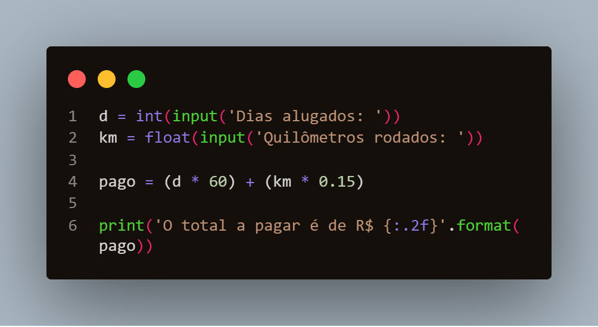

# Exercícios - Curso Python 3: Mundo 1

Exercícios de Python 3 feitos ao longo do curso Python 3 - Mundo 1 do [Curso em Vídeo](https://www.cursoemvideo.com/course/python-3-mundo-1/) do prof. Gustavo Guanabara.

Este curso tem como objetivo dar uma introdução à linguagem.

